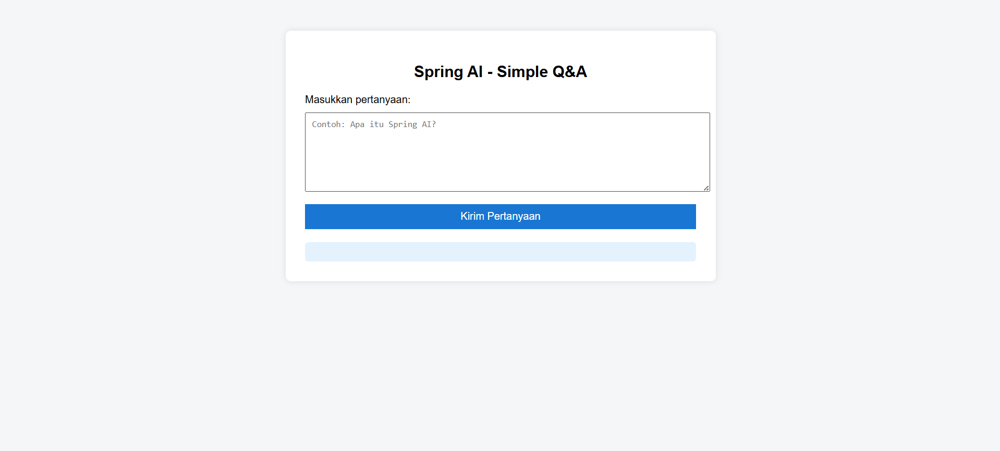
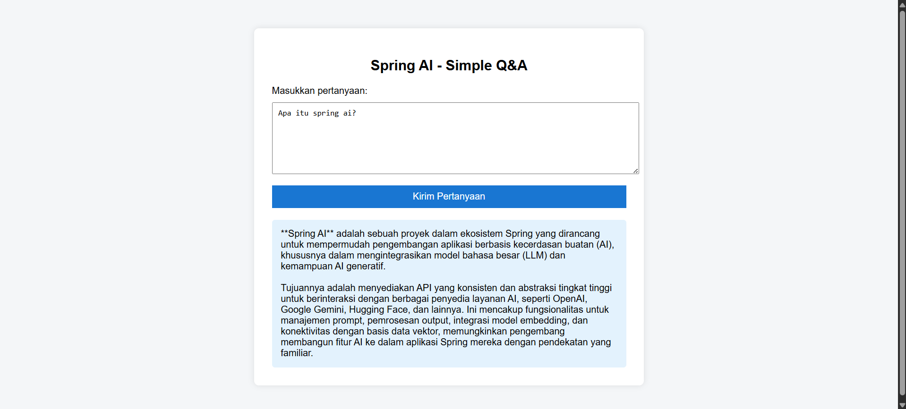

# UAS Spring AI - Integrasi Google Gemini & Spring Boot

 
 
 


## 📖 Tentang Proyek
[cite_start]Proyek ini adalah implementasi **Spring AI** untuk mengintegrasikan layanan **Large Language Model (LLM)** ke dalam aplikasi berbasis Spring Boot[cite: 14]. [cite_start]Aplikasi ini bertujuan untuk mendemonstrasikan bagaimana framework Spring dapat berinteraksi dengan model AI (Google Gemini) melalui lapisan abstraksi yang terstruktur[cite: 92].

[cite_start]Aplikasi ini dikembangkan sebagai pemenuhan Tugas Ujian Akhir Semester (UAS) pada mata kuliah Pemrograman Lanjut[cite: 15].

### 👥 Tim Pengembang
[cite_start]Proyek ini disusun oleh mahasiswa **Teknik Informatika - UIN Syarif Hidayatullah Jakarta**[cite: 7, 9]:

| NIM | Nama |
| :--- | :--- |
| **11230910000046** | [cite_start]Mochamad Syafiq Setiaji [cite: 3] |
| **11230910000060** | [cite_start]Akhsan Thufail Fadhlurrahman [cite: 4] |
| **11230910000054** | [cite_start]Dimas Adiluhur Panggarbesi [cite: 5] |
| **11230910000047** | [cite_start]Mochamad Daffa Hakimufarik [cite: 6] |

---

## 🛠️ Teknologi yang Digunakan
[cite_start]Aplikasi ini dibangun menggunakan *tech stack* modern berikut [cite: 25-33]:

* **Language:** Java 21
* **Framework:** Spring Boot 3.5.8
* **AI Framework:** Spring AI 1.1.2
* **LLM Model:** Google Gemini (gemini-2.0-flash / Simulated)
* **Build Tool:** Maven
* **Frontend:** HTML5 & JavaScript (Simple UI)
* **IDE:** VS Code

---

## ✨ Fitur Utama
1.  [cite_start]**Spring AI Abstraction:** Menggunakan `ChatClient` untuk memisahkan logika bisnis dengan vendor AI spesifik[cite: 55].
2.  [cite_start]**REST API Endpoints:** Menyediakan antarmuka API untuk komunikasi antara frontend dan backend AI[cite: 58].
3.  [cite_start]**Fault Tolerance (Mock Mode):** Sistem dilengkapi dengan mekanisme *fallback* ke mode simulasi jika terjadi limitasi kuota atau kegagalan koneksi API[cite: 75].
4.  [cite_start]**Simple Frontend:** Antarmuka web sederhana untuk melakukan tanya jawab dengan AI[cite: 68].

---

## ⚙️ Arsitektur & Implementasi Mock
Mengingat adanya batasan kuota (Rate Limiting) pada API LLM versi gratis, aplikasi ini menerapkan **Abstraction Layer** pada `AiService.java`.

Aplikasi memiliki fitur **Smart Fallback**:
* Secara default, aplikasi akan mencoba menghubungi API Google Gemini.
* [cite_start]Jika terjadi kendala (seperti Error 429: Quota Exceeded), sistem secara otomatis beralih ke **Mock Response** (Jawaban Simulasi)[cite: 76].
* [cite_start]Hal ini memastikan aplikasi tetap berjalan stabil (*High Availability*) tanpa *crash* saat presentasi atau pengujian[cite: 77].

**Prompt Template yang digunakan:**
> [cite_start]*"Kamu adalah asisten dosen bidang Teknologi Informasi. Jawablah secara singkat, jelas, dan akademik menggunakan bahasa Indonesia."*[cite: 57].

---

## 🚀 Cara Menjalankan Aplikasi

### Prasyarat
* Java Development Kit (JDK) 21 terinstal.
* Maven terinstal.

### Langkah Instalasi
1.  **Clone Repository**
    ```bash
    git clone [https://github.com/hibuakus19/SpringAI.git](https://github.com/hibuakus19/SpringAI.git)
    cd SpringAI
    ```

2.  **Konfigurasi API Key (Opsional)**
    [cite_start]Jika ingin menggunakan Live API, atur environment variable untuk keamanan[cite: 49].
    * **Windows:**
        ```cmd
        setx GEMINI_API_KEY "sk-xxxx-token-anda"
        ```
    * **Linux/Mac:**
        ```bash
        export GEMINI_API_KEY="sk-xxxx-token-anda"
        ```
    * *Catatan: Jika tidak diset, aplikasi akan berjalan dalam Mode Mock secara default.*

3.  **Jalankan Aplikasi**
    ```bash
    ./mvnw spring-boot:run
    ```

4.  **Akses Aplikasi**
    Buka browser dan kunjungi: `http://localhost:8080`

---

## 📡 Dokumentasi API
[cite_start]Berikut adalah endpoint yang tersedia dalam aplikasi ini [cite: 60-66]:

| Method | Endpoint | Deskripsi | Parameter |
| :--- | :--- | :--- | :--- |
| `GET` | `/ai/hello` | Menguji koneksi sederhana (Ping AI) | - |
| `GET` | `/ai/ask` | Mengirim pertanyaan ke AI | `?question=...` |

**Contoh Request:**
`GET http://localhost:8080/ai/ask?question=Apa itu Spring AI?`

---

## 📷 Screenshots

**1. Tampilan Antarmuka Frontend**

[cite_start]*(Tampilan formulir tanya jawab sederhana)* [cite: 70]

**2. Hasil Respon AI (Mode Simulasi/Live)**

[cite_start]*(Contoh jawaban yang diberikan oleh sistem)* [cite: 79]

---

## 📚 Referensi
* [cite_start][Dokumentasi Resmi Spring AI](https://docs.spring.io/spring-ai/reference/index.html) [cite: 100]
* [cite_start][Google Gemini API Docs](https://ai.google.dev/gemini-api/docs) [cite: 101]
* [cite_start][Spring Initializr](https://start.spring.io/) [cite: 102]

---
Copyright © 2025 - Teknik Informatika UIN Syarif Hidayatullah Jakarta
